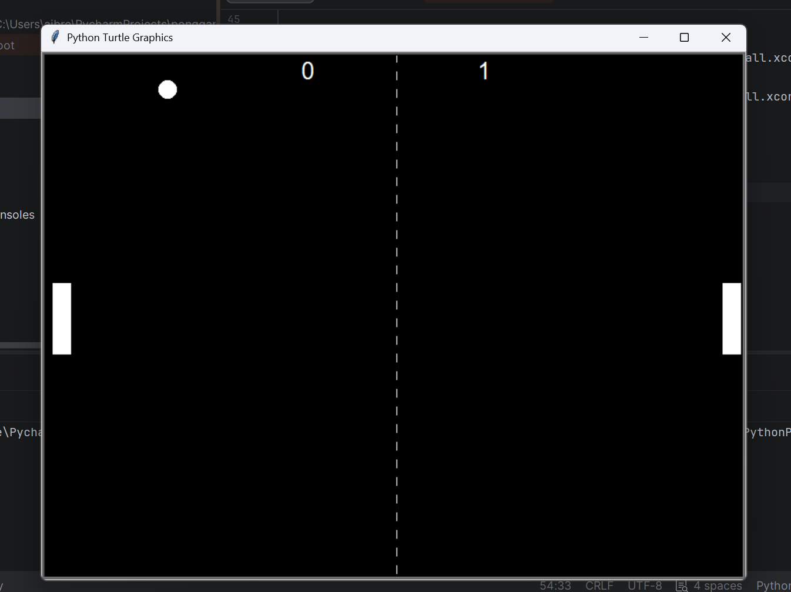

# Python Pong

A Pong game built in Python using the Turtle graphics library.

## Screenshot



## Features

- Single-player against an AI paddle
- Ball collisions with walls and paddles
- Score tracking
- Game over screen
- Object-oriented design

## How to Play

- Press **W** to move the paddle up.
- Press **S** to move the paddle down.
- Score by getting the ball past the AI paddle.
- The first player to **7 points** wins.

## Technologies

- Python
- Turtle Graphics

## How to Run

```bash
python main.py
```

## Future Improvements

- Two-player mode
- Difficulty settings
- Sound effects
- Smarter AI

## Author

Arthur Breault